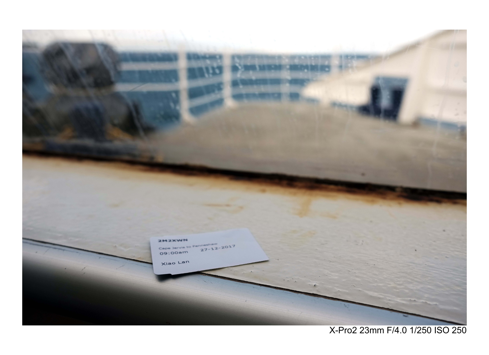

# bor
A script for adding border to image with custom options

（中文请看[这里](./README.cn.md)）

Recently I started writting blog posts on my website [haozhexu.me](https://haozhexu.me), and sometimes need to include photos with EXIF information. I like the idea of having white border around photos, just like Polaroid and Fujifilm instant photos, so I made this script to make it simple.

The script currently can add borders, and write EXIF text below the photo; As well as resizing and reducing quality of photo.

The script uses [ImageMagic®](https://www.imagemagick.org) mainly, [ExifTool](https://www.sno.phy.queensu.ca/~phil/exiftool/) is also needed if you want to remove EXIF from the photo itself, both of them can be install via [Homebrew](https://brew.sh/):

```
brew install imagemagic
brew install exiftool
```

bor.sh is a command line shell script that has a few options, with a mandatory input image file, and optional output file name, if no output file specified, it uses input_bor as the new file name with the same extension as the input file.

Examples of using bor.sh:

**resize by pixels**

```
./bor.sh -r 800x600 photo.jpg
```

**resize by percentage**

```
./bor.sh -r 80% photo.jpg
```

**resize by total pixels**

resize photo.jpg to no more than 4096 pixels in total (roughly 64x64)

```
./bor.sh -r 4096@ photo.jpg
```

**reduce image quality**

reduce quality of photo.jpg to 80%

```
./bor.sh -q 80 photo.jpg
```

**add border with pixel size**

add 20x20 pixels border around photo.jpg

```
./bor.sh -b 20x20 photo.jpg
```

**add border with percentage size**

add border around photo.jpg, the border is 5% of image width and 10% of image height

```
./bor.sh -b 5%x10% photo.jpg
```

**add EXIF on border**

add specified EXIF information at bottom right of image border, medium font size

```
./bor.sh -b 5%x10% -e cameramodel,focallength35,fnumber,exptime,isospeed,stripexif -f medium photo.jpg
```

Possible font sizes:

* small: font size that is 20% of border size
* medium: font size that is 30% of border size
* large: font size that is 50% of border size

Possible EXIF data (separated by comma when specified for -e):

* cameramodel
* focallength35
* fnumber
* exptime
* isospeed
* stripexif - this is not an EXIF data, when this is specified, EXIF will be removed in the generated photo

**Example with all options specified**

```
./bor.sh -b 5%x10% -e cameramodel,focallength35,fnumber,exptime,isospeed,stripexif -f medium -r 80% -q 70 photo.jpg photo_output.jpg
```

Generated photo:



I'll keep improving this script, please let me know how you think.
